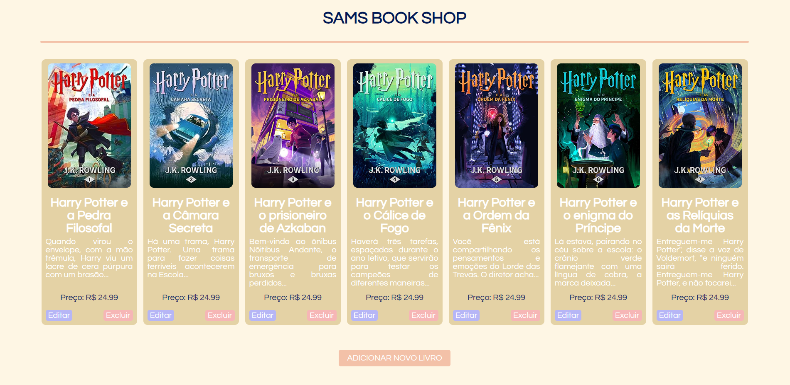

# Sams-Book-Shop

Exemplos:

  
  

Projeto CRUD simples utilizando React, Node.JS e MySQL!

## Tecnologias Utilizadas

O App foi desenvolvido utilizando as seguintes tecnologias:

- React para desenvolvimento do Front-End
- Node.JS para desenvolvimento do Back-End
- MySQL para desenvolvimento do Database

## Estrutura do Repositório

O repositório está organizado da seguinte forma:

- `backend/`: diretório para armazenar os arquivos relacionados ao Back-End
- `client/`: diretório contendo os arquivos do Front-End

## Licença

A licença [MIT](https://github.com/eagleyes005/Site_CPA/blob/main/LICENSE) permite que qualquer pessoa obtenha, use, modifique e distribua o software sob os termos da licença. Ela oferece liberdade aos desenvolvedores para adaptar o software de acordo com suas necessidades e usá-lo em projetos comerciais e não comerciais, sem restrições significativas.
